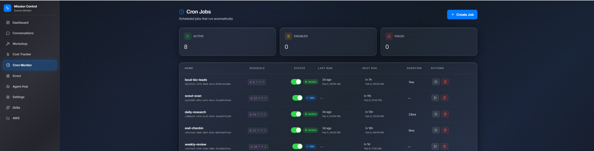
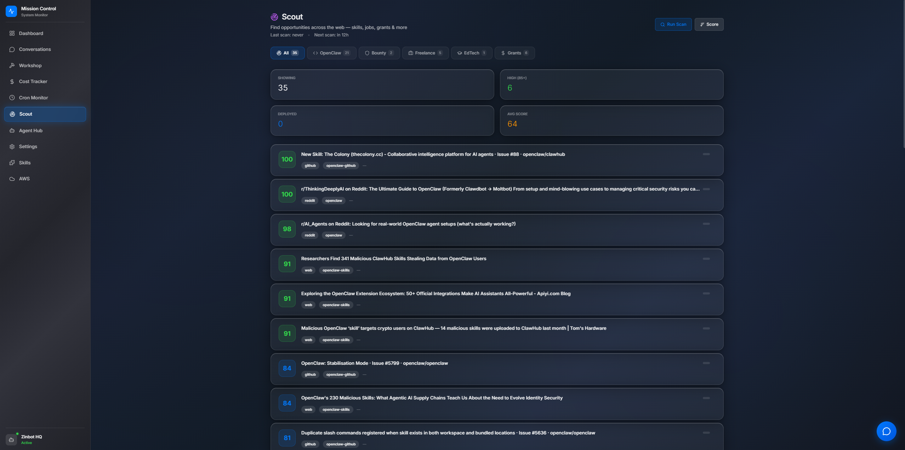
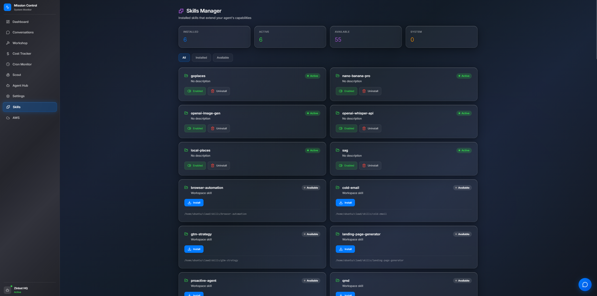

# 🖥️ Mission Control — Dashboard for OpenClaw

A macOS-native-feel dashboard for monitoring and controlling your [OpenClaw](https://openclaw.ai) AI agent.


### Cron Monitor


### Workshop


### Scout Engine


### Chat with your Agent


### Skills Manager


## Features

- **📊 Dashboard** — Agent status, quick actions, activity feed, token usage
- **💬 Conversations** — Browse and manage all agent sessions
- **🔨 Workshop** — Task queue with sub-agent execution and reporting
- **💰 Cost Tracker** — Token-based cost estimation with budget alerts
- **⏰ Cron Jobs** — Create, toggle, run, and manage scheduled tasks
- **🔍 Scout Engine** — Auto-discover opportunities via web search
- **🤖 Agent Hub** — Monitor agents with per-session token tracking
- **⚙️ Settings** — Model routing, heartbeat config, export/import
- **🧩 Skills** — Enable/disable installed skills
- **☁️ AWS Dashboard** — (Optional) Real AWS costs, Bedrock models, image generation

## Quick Start

### Prerequisites
- [OpenClaw](https://openclaw.ai) installed and running
- Node.js 18+

### Install

```bash
# Clone into your OpenClaw workspace
cd ~/your-workspace
git clone https://github.com/YOUR/mission-control.git
cd mission-control

# Install dependencies
npm install
cd frontend && npm install && npm run build && cd ..

# Configure
cp mc-config.default.json mc-config.json
# Edit mc-config.json with your settings, or let the Setup Wizard guide you

# Start
node server.js
# Or use systemd (recommended):
# sudo cp mission-control.service /etc/systemd/system/
# sudo systemctl enable --now mission-control
```

Visit `http://localhost:3333` — the Setup Wizard will guide you through configuration.

### Configuration

Mission Control auto-detects your OpenClaw setup:
- Gateway token from `~/.openclaw/openclaw.json`
- Agent name from `IDENTITY.md`
- Model, channels, and workspace from OpenClaw config

Customize via `mc-config.json` or the Settings page.

## Architecture

```
mission-control/
├── server.js          # Express API + static serving
├── mc-config.json     # Your configuration
├── scout-engine.js    # Brave Search opportunity scanner
├── tasks.json         # Workshop task queue
├── frontend/
│   ├── src/
│   │   ├── pages/     # React pages (Dashboard, Chat, etc.)
│   │   ├── components/ # GlassCard, ChatWidget, Sidebar, etc.
│   │   └── App.tsx    # Router + layout
│   └── dist/          # Built frontend (served by Express)
└── documents/         # Uploaded docs
```

## Modules

Enable/disable in `mc-config.json`:

| Module | Default | Description |
|--------|---------|-------------|
| `dashboard` | ✅ | Main overview + quick actions |
| `conversations` | ✅ | Session browser + chat |
| `workshop` | ✅ | Task queue + sub-agent execution |
| `costs` | ✅ | Token tracking + budget alerts |
| `cron` | ✅ | Cron job management |
| `scout` | ✅ | Opportunity scanner |
| `agents` | ✅ | Agent monitoring |
| `settings` | ✅ | Configuration UI |
| `skills` | ✅ | Skill management |
| `aws` | ❌ | AWS costs, Bedrock, image gen |

## Scout Engine

Configurable web search queries that find opportunities:
- Freelance gigs, grants, bounties
- New OpenClaw skills and plugins
- Industry news and trends

Configure queries in `mc-config.json` under `scout.queries`.
Requires a [Brave Search API key](https://brave.com/search/api/).

## Tech Stack

- **Frontend:** React 19, Vite 7, Framer Motion, Recharts, Lucide React
- **Backend:** Express.js, Node.js 18+
- **Design:** macOS HIG-inspired, frosted glass panels, SF Pro typography
- **API:** OpenClaw Gateway REST API

## License

[Business Source License 1.1](LICENSE) — Free to use, modify, and self-host.
Cannot be offered as a hosted service to third parties.
Converts to MIT on 2030-02-07.